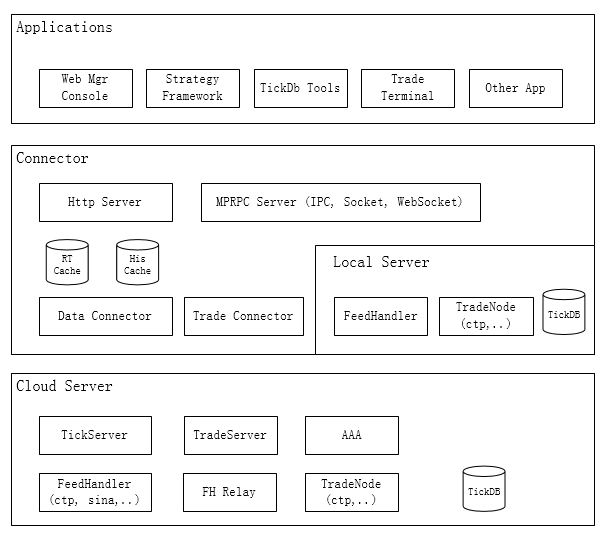

采用多进程、分布式部署方案设计，通过合理划分功能模块，实现业务功能解耦。各模块之间进程隔离，实现高效稳定的系统。

系统由三部分组成，如图所示。

  

### 高频应用解决方案

上述通用的分布式方案不适合高频交易等需要极高速度的场景。在这类场景中，TQuant采用进程内模式，最小减少数据传输、跨进程方法调用的性能开销。

## 各部分说明

- [服务层](services)
- [连接层](connector)
- [应用层](applications)
- [用户策略安全保障](security)
- [TQuantApi](tquant_api)
- [技术](tech)

