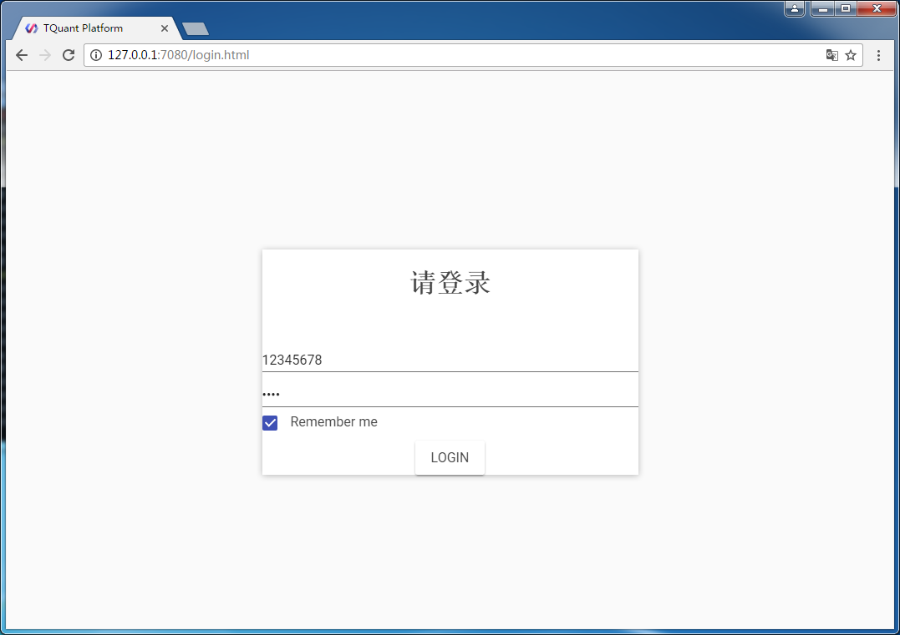
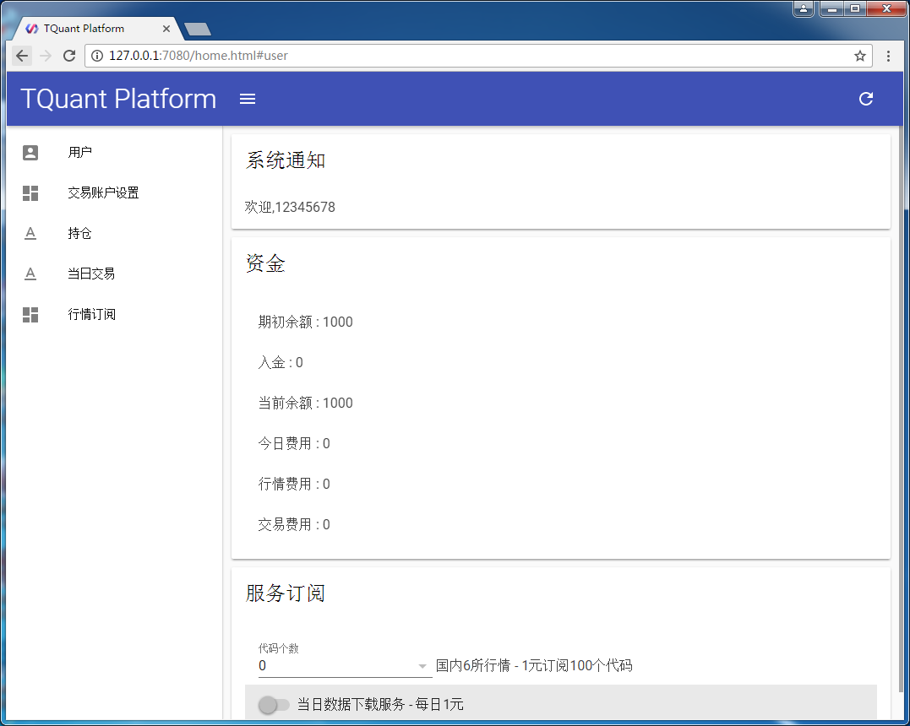
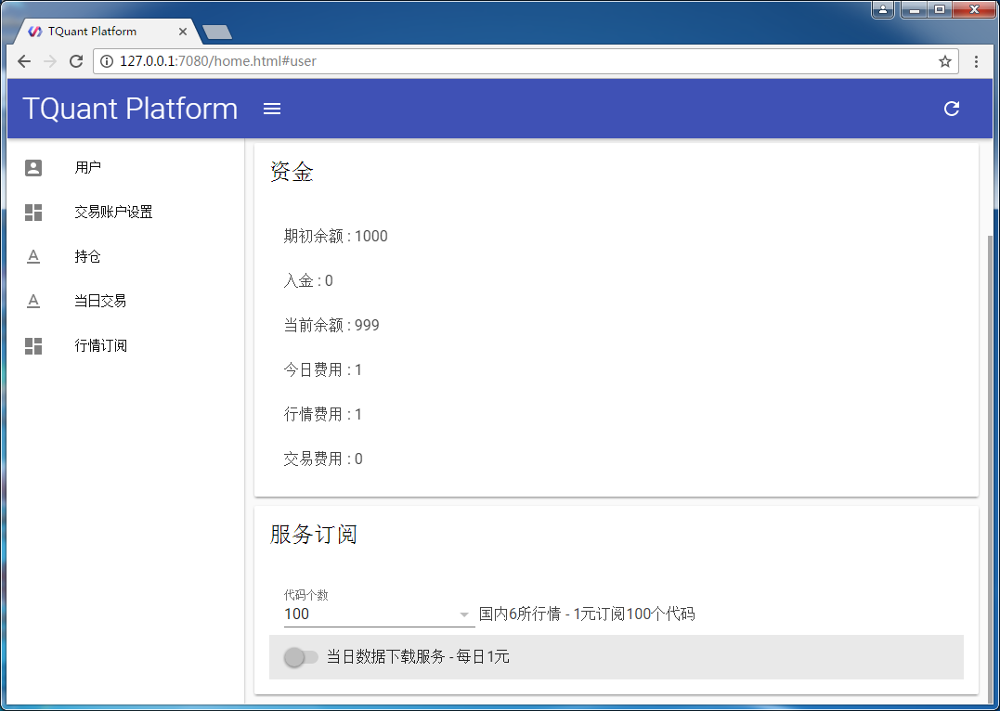
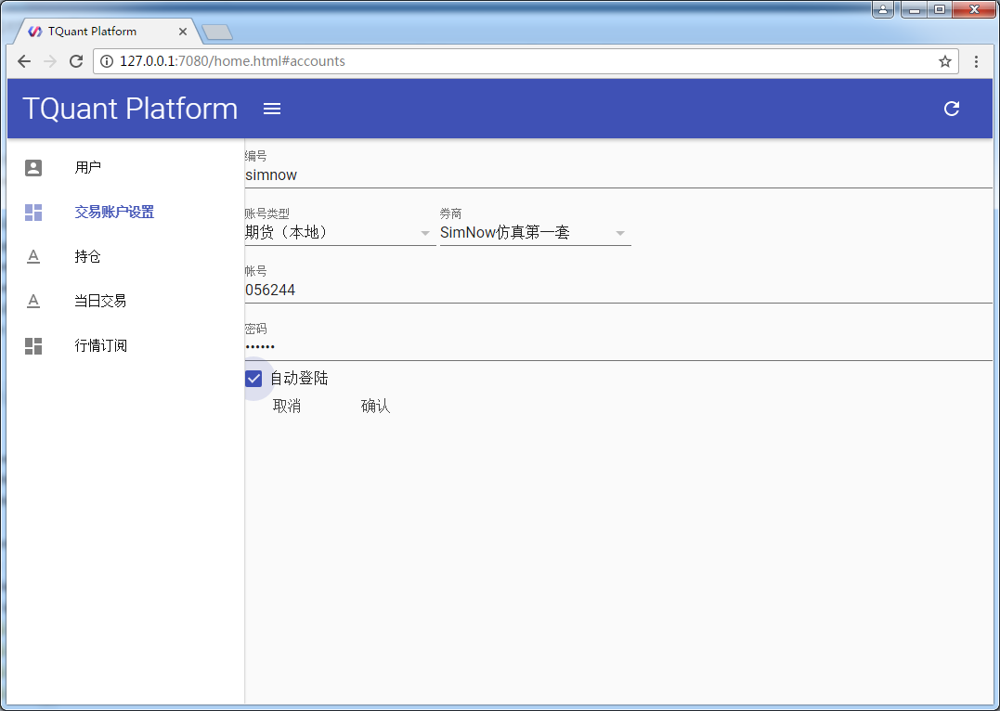
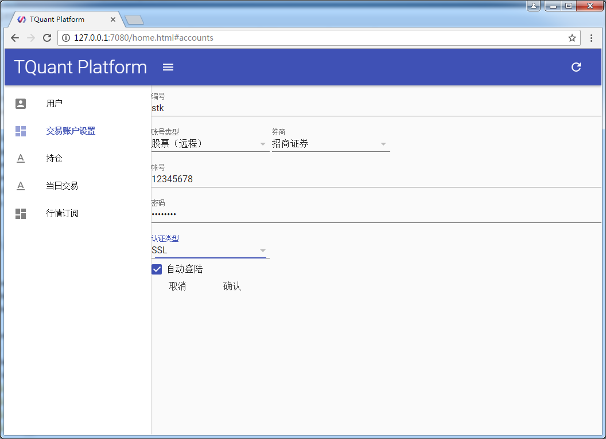

tqc(TQuant Connector)是用于连接TQuant的云服务，给本地程序提供行情和交易服务。

## 配置

tqc主程序的配置文件是etc/tqc.conf，建议不要修改。如果端口冲突，请自行修改。

建议不要修改svr_port。

```json
{
    "portal_addr" : "http://svr1.acqusta.com:8080",
    "tksvr_addr"  : "tcp://svr1.acqusta.com:10013",
    "tdsvr_addr"  : "tcp://svr1.acqusta.com:10003",

    "svr_port": 10001, // 服务端口，如果冲突，请修改
    "svr_ip": "127.0.0.1",

    "http_port": 7080, // Web配置端口，如果冲突，请修改
    "http_ip": "127.0.0.1"
}
```

## 运行

tqc是个命令行程序，启动后在两个端口上启动服务：
- 端口7080上启动Web服务，用于配置
- 端口10001上启动TQuantApi服务

```
d:\tquant\tqc\bin>tqc
Could not create log file: File exists
COULD NOT CREATE LOGFILE '20180219'!
I0219 12:56:26.021052  4248 Start server at tcp://127.0.0.1:10001
I0219 12:56:26.036653  6188 create shmem shm_tqc_v1_tqc_10001
I0219 12:56:26.036653  4248 Start ipc server at ipc://tqc_10001
Could not create log file: File exists
COULD NOT CREATE LOGFILE '20180219'!
W0219 12:56:26.036653  4248 No mkt in tkcfg
I0219 12:56:26.036653  3300 create shmem shm_tqc_v1_tkrecv_1089380105
I0219 12:56:26.036653  4248 md_sina: Init md_sina
I0219 12:56:26.036653  4248 md_sina: Start md_sina
I0219 12:56:26.223841  2404 Start web server at tcp://127.0.0.1:7080
I0219 12:56:26.223841  2404 Set web home: C:\tquant\tqc\web
Could not create log file: File exists
COULD NOT CREATE LOGFILE '20180219'!
I0219 12:56:26.301836  5616 Create user session: user,S_user_245335638
I0219 12:56:26.317435   200 Login successfully
I0219 12:56:27.362576  4248 Please open browser to login
I0219 12:56:27.362576  4248 http://127.0.0.1:7080
```

## 登录

**登录页面**

请用**Chrome浏览器**打开[http://127.0.0.1:7080]，使用tqc的免费帐号登录。

如果没有帐号，请先在www.acqusta.com上免费注册一个帐号。

<div class="pic-plus">
  
</div>

**首页**

登录成功后，首页显示用户的服务订阅情况。

<div class="pic-plus">
  
</div>

## 行情配置

### 订阅云行情

为方便用户使用，云服务提供实时行情和7天的历史数据。用户可以根据需要选择是否订阅。

图示为订阅100个代码的行情。

<div class="pic-plus">
  
</div>

注意：
> 1. 当日数据下载服务暂时不可用。
> 1. 云行情的股票行情是新浪网的Level1行情。
> 1. 期货主力合约包含了历史上所有的主力合约，如果用主力合约订阅的话，实际上是订阅了多个代码。

## 交易帐号配置

TQuant支持股票和期货的交易。

**请给每个交易帐号编个唯一的编号，用于下单时指定交易帐号。**

### ctp期货交易配置


<div class="pic-plus">
  
</div>

### 股票外挂交易配置

<div class="pic-plus">
  
</div>


